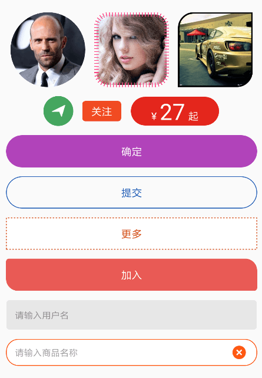

# SuperShapeView
A smart custom view support shapes for TextView ,EditView ,instead of shape.xml. CLICK THE ***STAR***  if it's useful for you.

## Preview

## Custom attribute
| attribute | format | example  |
| :------------- |:-------------| :-----|
| super_cornerRadius | dimension      | app:super_cornerRadius="5dp" |
| super_strokeWidth | dimension      | app:super_strokeWidth="1dp" |
| super_strokeColor | color/reference       | app:super_strokeColor="#bebebe" |
| super_solidColor | color/reference     | app:super_solidColor="@color/red" |
| super_dashWidth | dimension     | app:super_dashWidth="2dp" |
| super_dashGap | dimension     | app:super_dashGap="2dp" |
| super_topLeftRadius | dimension     | app:super_topLeftRadius="2dp" |
| super_topRightRadius | dimension     | app:super_topRightRadius="2dp" |
| super_bottomLeftRadius | dimension     | app:super_bottomLeftRadius="2dp" |
| super_bottomRightRadius | dimension     | app:super_bottomRightRadius="2dp" |

## Gradle
```java
 compile 'com.kingja.supershapeview:supershapeview:1.1.1'
```

## Usage
```xml
<com.kingja.supershapeview.SuperShapeTextView
        android:textColor="#ffffff"
        android:layout_width="match_parent"
        android:layout_height="wrap_content"
        android:gravity="center"
        android:padding="12dp"
        android:text="Sure"
        app:super_cornerRadius="56dp"
        app:super_solidColor="#b143ba"/>
```


## Changelog

**v1.1.1**
- Initial release 

## Contact me
Any questions,Welcome to contact me.
* email:kingjavip@gmail.com
* [Blog](http://www.jianshu.com/u/8a1a8ed656e8)

## License

    Copyright 2017 KingJA

    Licensed under the Apache License, Version 2.0 (the "License");
    you may not use this file except in compliance with the License.
    You may obtain a copy of the License at

        http://www.apache.org/licenses/LICENSE-2.0

    Unless required by applicable law or agreed to in writing, software
    distributed under the License is distributed on an "AS IS" BASIS,
    WITHOUT WARRANTIES OR CONDITIONS OF ANY KIND, either express or implied.
    See the License for the specific language governing permissions and
    limitations under the License.
